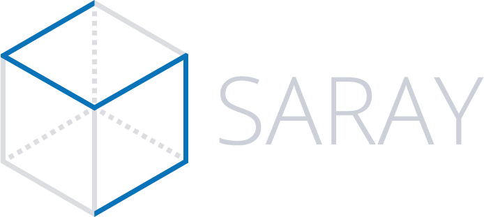

<!-- # Saray -->



[](https://travis-ci.org/contactlab/saray)
[](https://github.com/contactlab/saray)
[](https://github.com/contactlab/saray)
[](http://packagequality.com/#?package=saray)

```javascript
'Yet Another Rest API Stubber'.split(' ').reverse().map(item => item[0].toLowerCase()).join('')
```

> This is a simple API stubber for testing purposes.

## How to use

The stubber responses are based on a filesystem hierarchy of JS and JSON files, so to
simulate the behaviour of your API you need to reproduce the HTTP URI using path
on your filesystem. The final part of your URL and the HTTP method define the
name of the JSON/JS file that the simple stubber will read to respond to your test
requests.
Probably it's better explained with an example.

### Example

For a simple `HTTP GET`:

-   test URL to map: `HTTP GET` to  `/give/me/some/data`
-   JSON file path: `[root]/give/me/some/data.GET.json`

For a parametrized `HTTP GET`:

-   test URL to map: `HTTP GET` to  `/give/me/some/data?traveler=marty&friend=emmet`
-   JSON file path: `[root]/give/me/some/data?traveler=marty&friend=emmet.GET.json`

For a parametrized `HTTP POST`:

-   test URL to map: `HTTP POST` to  `/give/me/some/data` with `x-www-form-urlencoded` parameters like
  traveler:marty
  friend:emmet
-   JSON file path: `[root]/give/me/some/data?traveler=marty&friend=emmet.POST.json`

The same applies for the others `HTTP` methods.

## A note on HTTP POSTs

This stubber has a basic support for POST requests, so the parameters should be
very simple, similar to a GET request.

## Data stubbed in JS format

From version 1.5.0 Saray has the built-in support for data stubbed in JS format. With this new format, you can prepare scriptable stubbed data interpeted directly by Node.js.

Every JS-stubbed file must be a Node.js module exporting a single function. This function can take four parameters:

- *req*: [Express Request object](http://expressjs.com/en/4x/api.html#req)
- *res*: [Express Response object](http://expressjs.com/en/4x/api.html#res)
- *log*: [Bunyan Log object](https://github.com/trentm/node-bunyan)
- *next*: next middleware function

For example:

```javascript
module.exports = function(req, res, log, next) {
  res.json({key: 'value'});
};
```

## Endpoint integration

Saray can operate as a proxy between the client and your api endpoint. So, if you define
an endpoint, saray can redirect your calls without stubbed data directly to your real APIs.
Using the parameter '--prefer-api', you can tell Saray to prefer real APis instead of stubbed data.

## Installation & run

You can install Saray with npm locally to you project, but the preferred way is the global installation

```bash
$ npm install -g saray
```

Then you can start Saray

```bash
$ saray --port 8081 --path /path/to/data --endpoint 'https://myapis.com' --prefer-api
```

## Clone

Alternatively you can clone this repo, then from the command line run

```
$ npm install
```

to install all required dependencies, then you can run

```
$ node index.js --port 8081 --path /path/to/data --endpoint 'https://myapis.com' --prefer-api
```

## Help
```bash
$ saray --help

  Usage: index [options]

  'Yet Another Rest API Stubber'.split(' ').reverse().map(item => item[0].toLowerCase()).join('')

  Options:

    -h, --help                output usage information
    -V, --version             output the version number
    --port <port>             The port to listen to (default: 8081)
    --path <password>         The path for stubbed data (default ./data)
    --endpoint <endpoint>     The endpoint (default null)
    --pfer-api, --prefer-api  Prefer API enpoint to stubbed data (default: false)
```

## Available commands

```
$ npm test
```

Run unit tests and integration tests for Saray.

```
$ npm start
```

Start Saray from command line directly from cloned repository
